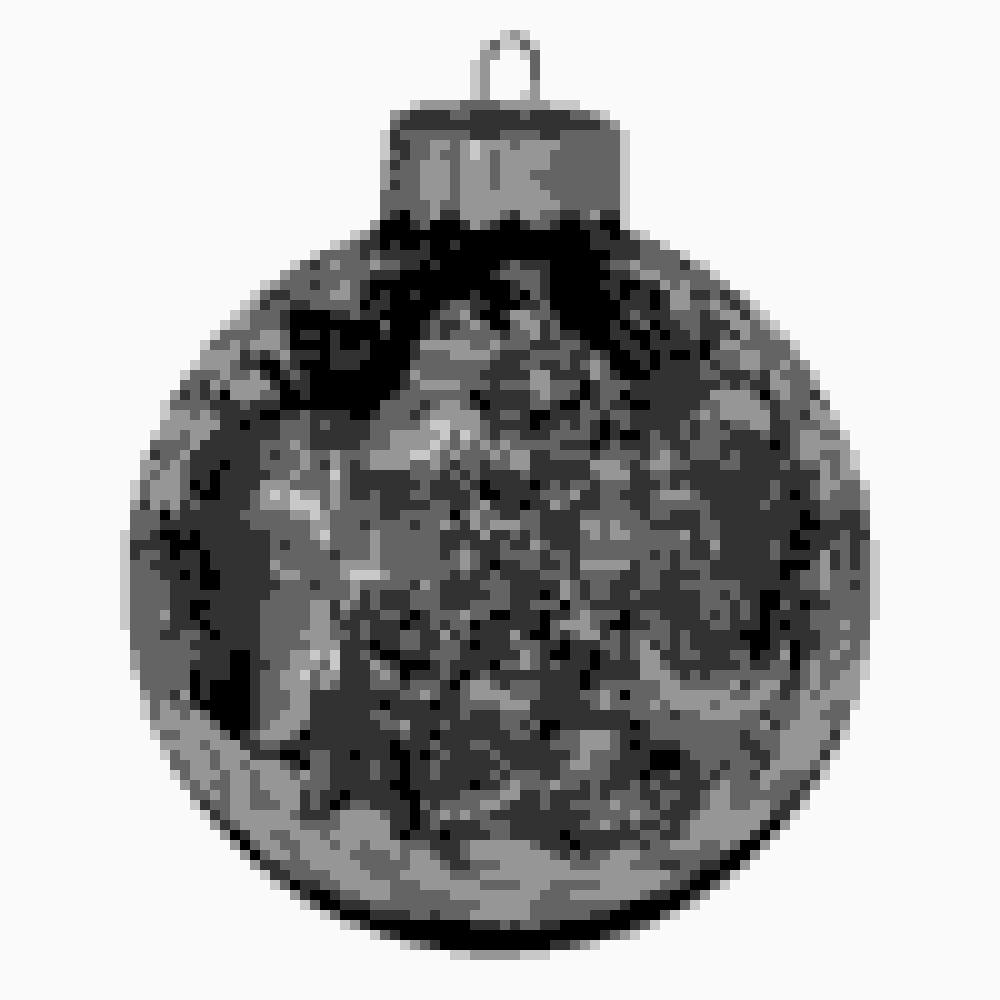
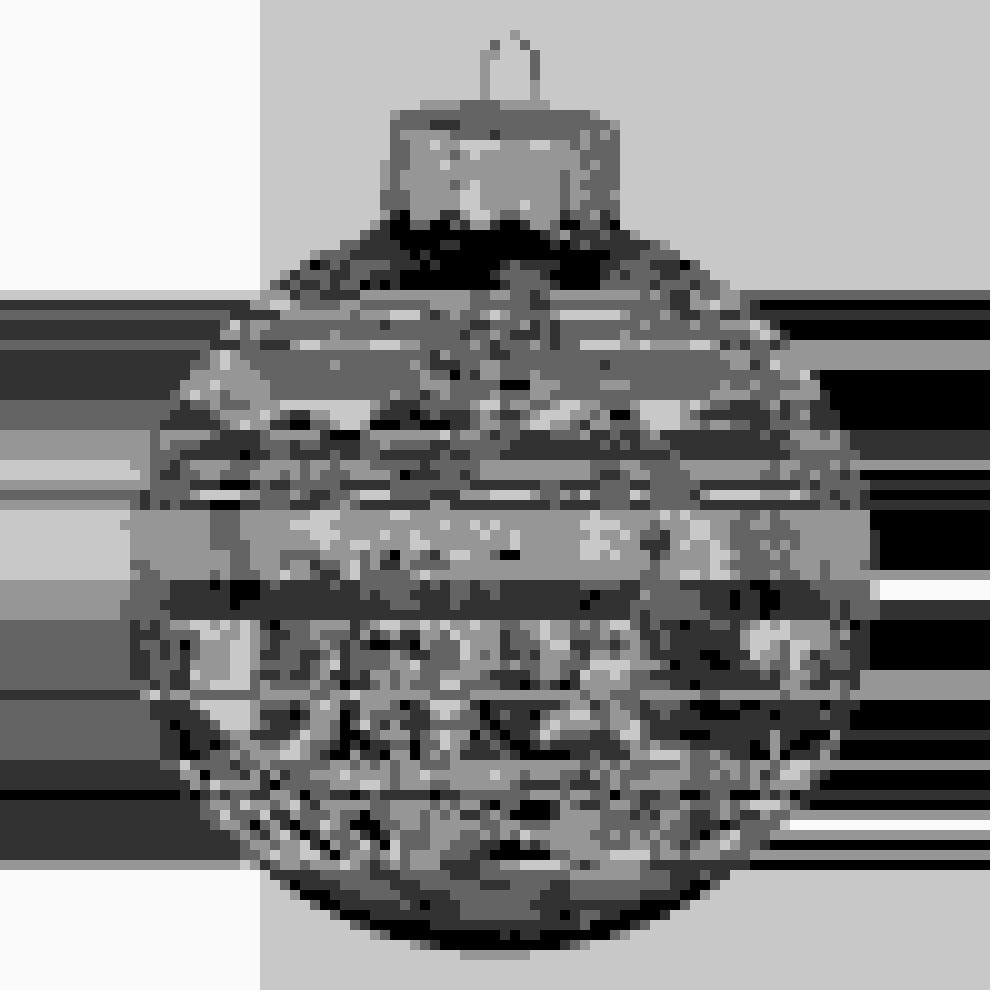
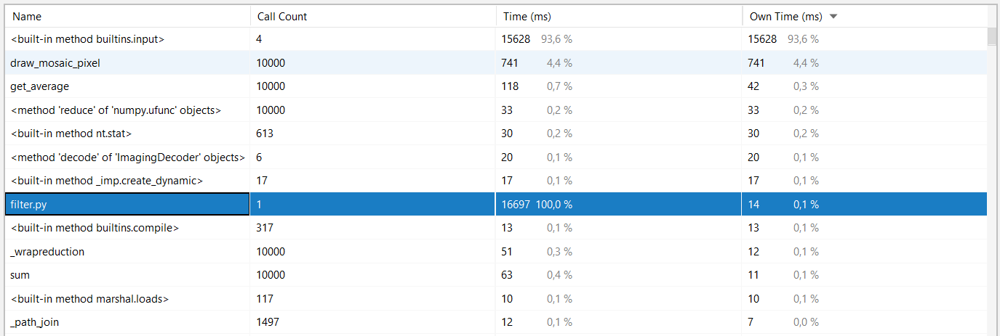
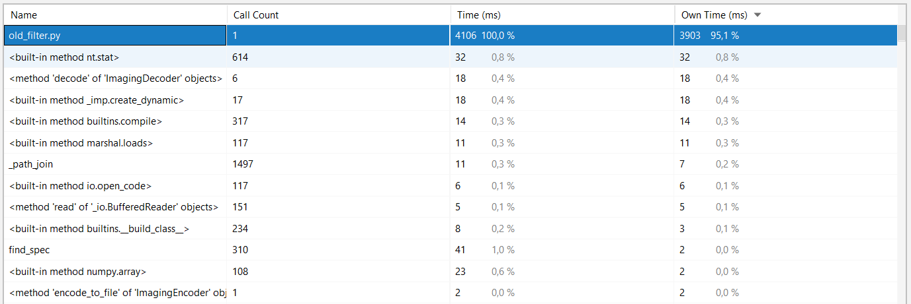
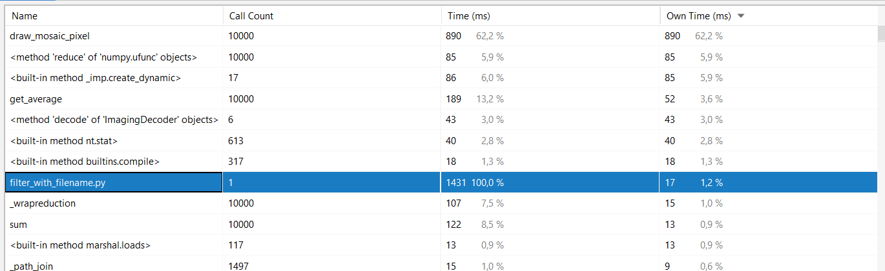
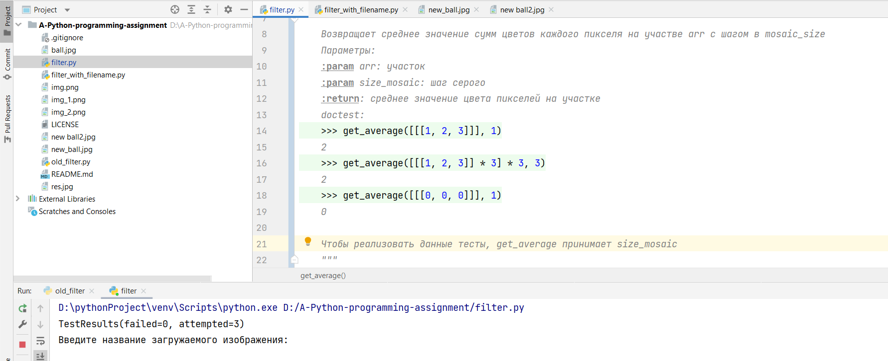

# A-Python-programming-assignment

Изображение до: 

Изображение после работы filter.py : 

Изображение после работы old_filter.py: 

Время выполнения filter.py: 

Время выполнения old_filter: 

Время выполнения filter.py больше чем old_filter.py, потому что при работе с filter.py мы вручную вводили "Название загружаемого изображения", "Размер мозаики", "Шаг серого" и "Название выгружаемого изображения", а это занимает время работы filter.py. Поэтому, время работы filter.py зависит от быстродействия пользователя: чем быстрее пользователь введёт входные данные, тем быстрее выполнится filter.py.

Время выполнения filter_with_filename.py: 

Время выполнения filter_with_filename.py меньше чем filter.py, потому что данные инициализируются автоматически. Также filter_with_filename выполняется быстрее old_filter, так как filter_with_filename - это усовершенствованный old_filter, и old_filter работает некорректно.

Скриншот выполненных doc-тестов: 
Смог реализовать doc-тесты только для функции "get_average", которая возвращает среднее значение сумм цветов каждого пикселя на участве arr с шагом в mosaic_size.
Для функции "draw_mosaic_pixel" doc-тесты не реализовал.